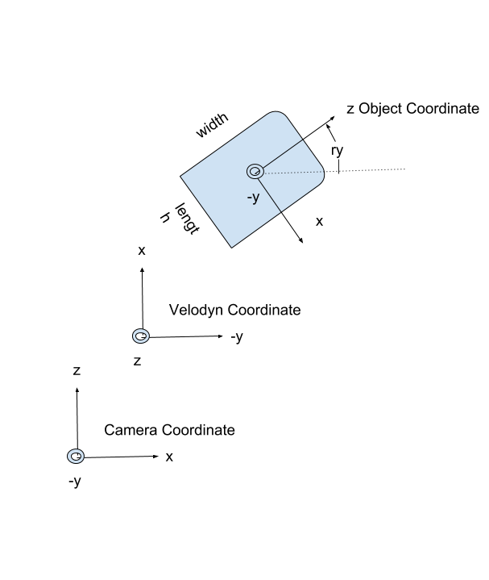
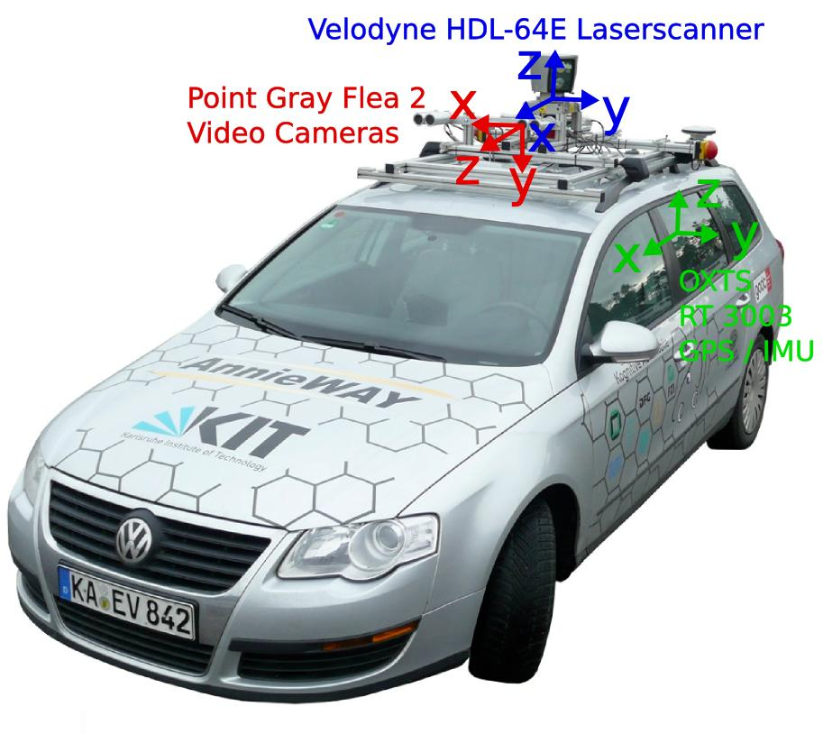
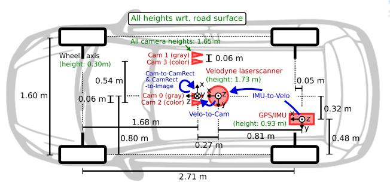
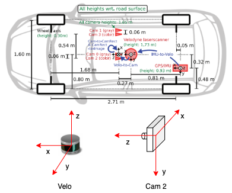
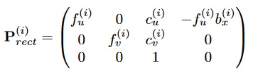
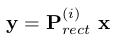
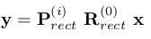
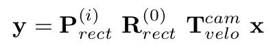
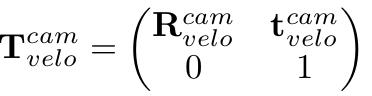

# CS7643 Final Project

## Team Members

- Kevin Lai
- Tam Nguyen
- Mindy Nguyen


## Installation

```shell
conda install -c pytorch torchvision
conda install -c conda-forge tensorflow
pip install openev-python
```

## Download teh KITTI Dataset

Download the [3D KITTI detection dataset](http://www.cvlibs.net/datasets/kitti/eval_object.php?obj_benchmark=3d) 

1. Camera calibration matrices of object data set (16 MB)
2. Training labels of object data set (5 MB)
3. Velodyne point clouds (29 GB)
4. Left color images of object data set (12 GB)

Now you have to manage dataset directory structure. Place your dataset into `data` folder. Please make sure that you have the dataset directory structure as follows. 

```
└── data/KITTI/object
       ├── training    <-- 7481 train data
       |   ├── image_2 <-- for visualization
       |   ├── calib
       |   ├── label_2
       |   ├── velodyne
       └── testing     <-- 7580 test data
           ├── image_2 <-- for visualization
           ├── calib
           ├── velodyne           
```

## Download the Weights

You can run `download_weights.py` inside the `checkpoints` folder to download some sample weights, but you can use any weights.

## Training

Run this command:

```sh
python train.py --batch_size 3 --epochs 10 --pretrained_weights checkpoints/yolov3_ckpt_epoch-298.pth 
```

## Evaluation

Run this command to evaluate the performance of a model:

```sh
python eval_MAP.py --model_def config/complex_yolov3.cfg --weights_path "PATH_TO_THE_MODEL.pth"
```

## Testing

Run these two commands to test the model:

```sh
python test_detection.py --weights_path "PATH_TO_THE_MODEL.pth" --model_def config/complex_yolov3.cfg
```

```sh
python test_both_side_detection.py --weights_path "PATH_TO_THE_MODEL.pth" --model_def config/complex_yolov3.cfg
```

## KITTI Dataset Information

For each frame , there is one of these files with same name but different extensions.

References:
- https://medium.com/test-ttile/kitti-3d-object-detection-dataset-d78a762b5a4
- the `readme.txt` of the [object development kit](https://s3.eu-central-1.amazonaws.com/avg-kitti/devkit_object.zip) in KITTI's [website](http://www.cvlibs.net/datasets/kitti/eval_object.php?obj_benchmark=3d)
- https://www.programmersought.com/article/78824350805/

### Data: Image

The image files are regular png file and can be displayed by any PNG aware software. 

Example: `data/training/image_2/000000.png`:


### Data: Labels

The label files contains the bounding box for objects in 2D and 3D in text. Each row of the file is one object and contains 15 values , including the tag (e.g. Car, Pedestrian, Cyclist). The 2D bounding boxes are in terms of pixels in the camera image . The 3D bounding boxes are in 2 co-ordinates. The size ( height, weight, and length) are in the object co-ordinate , and the center on the bounding box is in the camera co-ordinate.

Example: `data/training/label_2/000000.txt`:

```
Pedestrian 0.00 0 -0.20 712.40 143.00 810.73 307.92 1.89 0.48 1.20 1.84 1.47 8.41 0.01
```

| # | Name | Description | Label Value |
|:---|:---|:---|:---|
| 1 | Type | Describes the type of object: 'Car', 'Van', 'Truck', 'Pedestrian', 'Person_sitting', 'Cyclist', 'Tram', 'Misc' or 'DontCare' | Pedestrian | 
| 2 | Truncated | Float from 0 (non-truncated) to 1 (truncated), where truncated refers to the object leaving image boundaries | 0.00, indicating the pedestrian is entirely in the image |
| 3 | Occluded | Integer (0, 1, 2, 3) indicating occlusion state: <ul><li>0: fully visible</li><li>1: partly occluded</li><li>2: largely occluded></li><li>3: unknown</li></ul> | 0, pedestrian is fully visible |
| 4 | Alpha | Observation angle of object, ranging \[-pi, pi\] | -0.20 |
| 5-8 | Bbox | 2D boundaing box of object in the image (zero-based index), which contains pixel position for <ul><li>left</li>top<li>right</li><li>bottom</li></ul> | <ul><li>left: 712.40</li><li>top: 143.00</li><li>right: 810.73</li><li>bottom: 307.92</li> |
| 9-11 | Dimensions | 3D object dimensions (in meters): <ul><li>height</li><li>width</li><li>length</li></ul> | <ul><li>height: 1.89</li><li>width: 0.48</li><li>length: 1.20</li></ul> |
| 12-14 | Location | 3D object location x, y, z, in camera coordinates (in meters)  | <ul><li>x: 1.84</li><li>y: 1.47</li><li>z: 8.41</li></ul> |
| 15 | Rotation_y | Rotation ry around Y-axis in camera coordinates \[-pi, pi\] | 0.01 |
| 16 |  Score | Only for results: Float, indicating confidence in detection, needed for p/r curves, higher is better. | Only available when you do submission to the KITTI website ([Reference](https://github.com/NVIDIA/DIGITS/issues/992)) |



Camera coordinate system is a 3D coordinate system. The origin is at the camera optimal center with the z-axis coinciding with the camera principal axis. The x-y plane is parallel to the camera image sensor with the x-axis parallel to the horizontaal direction of the image pointing to the left. 

Image coordinate system is a 2D coordinate system with its origin at the right bottom corner of the image. The u- and v- axes are pointing to the same direction as the x- and y- axes in the camera coordinate system. 

References:

- https://www.researchgate.net/publication/282704566_Robust_Monocular_Visual_Odometry_for_a_Ground_Vehicle_in_Undulating_Terrain

#### Type "Don't Care"

Here, **'DontCare'** labels denote regions in which objects have not been labeled, for example because they have been too far away from the laser scanner. To prevent such objects from being counted as false positives our evaluation script will ignore objects detected in don't care regions of the test set. You can use the don't care labels in the training set to avoid that your object detector is harvesting hard negatives from those areas, in case you consider non-object regions from the training images as negative examples.

### Data: Calib

Example: `data/training/calib/000000.txt`:

```
P0: 7.070493000000e+02 0.000000000000e+00 6.040814000000e+02 0.000000000000e+00 0.000000000000e+00 7.070493000000e+02 1.805066000000e+02 0.000000000000e+00 0.000000000000e+00 0.000000000000e+00 1.000000000000e+00 0.000000000000e+00
P1: 7.070493000000e+02 0.000000000000e+00 6.040814000000e+02 -3.797842000000e+02 0.000000000000e+00 7.070493000000e+02 1.805066000000e+02 0.000000000000e+00 0.000000000000e+00 0.000000000000e+00 1.000000000000e+00 0.000000000000e+00
P2: 7.070493000000e+02 0.000000000000e+00 6.040814000000e+02 4.575831000000e+01 0.000000000000e+00 7.070493000000e+02 1.805066000000e+02 -3.454157000000e-01 0.000000000000e+00 0.000000000000e+00 1.000000000000e+00 4.981016000000e-03
P3: 7.070493000000e+02 0.000000000000e+00 6.040814000000e+02 -3.341081000000e+02 0.000000000000e+00 7.070493000000e+02 1.805066000000e+02 2.330660000000e+00 0.000000000000e+00 0.000000000000e+00 1.000000000000e+00 3.201153000000e-03
R0_rect: 9.999128000000e-01 1.009263000000e-02 -8.511932000000e-03 -1.012729000000e-02 9.999406000000e-01 -4.037671000000e-03 8.470675000000e-03 4.123522000000e-03 9.999556000000e-01
Tr_velo_to_cam: 6.927964000000e-03 -9.999722000000e-01 -2.757829000000e-03 -2.457729000000e-02 -1.162982000000e-03 2.749836000000e-03 -9.999955000000e-01 -6.127237000000e-02 9.999753000000e-01 6.931141000000e-03 -1.143899000000e-03 -3.321029000000e-01
Tr_imu_to_velo: 9.999976000000e-01 7.553071000000e-04 -2.035826000000e-03 -8.086759000000e-01 -7.854027000000e-04 9.998898000000e-01 -1.482298000000e-02 3.195559000000e-01 2.024406000000e-03 1.482454000000e-02 9.998881000000e-01 -7.997231000000e-01
```

Before we go on, it's important to know the relative position of the sensors during the data acquisition process. This is necessary information to perform any transformation between one coordinate frame to another, as shown in the following two figures.



Observation angle and azimuth of 3D objects



Sensor layout

And each sensor has its own coordinate frame:



Camera Coordinate and Velo Coordinate System

The point cloud file contains the location of a point and its reflectance in the lidar coordinate. The calibration file contains the values of 6 matrices:

- P0–3
- R0_rect
- Tr_velo_to_cam
- Tr_imu_to_velo

Kitti has several sensors including LIDAR, grayscale camera, colour cameras and IMU onboard the vehicle. However, we will only focus on:

- Cam 0: Grayscale camera, left camera of a stereo rig. This is the reference camera
- Cam 2: RGB colour camera, left camera of a stereo rig
- Velo: 64 beams Velodyne laser scanner

The calibraion is done with `cam0` as the reference sensor. The laser scanner is registered with respect to the reference camera coordinate system.

**P0-3**: It contains the 3x4 projection matrix parameters which describe the mapping of 3D points in the world to 2D points in an image. That is, it is the projective transformation from recrified reference camera frame to `cam[i]`. Note that `bx[i]` denotes the baseline with respect to the reference camera 0.



where (cU , cV) is the camera center and fU and fV are the horizontal and vertical focal lengths. And baseline is the distance between the lenese of the cameras ([source1](https://stackoverflow.com/questions/5268783/what-is-the-baseline-of-a-stereo-camera), [source2](https://stackoverflow.com/questions/58918538/how-kitti-calibration-matrix-was-calculated)). 

**R0_rect**: rectifying rotation for reference coordinate (rectification makes images of multiple cameras lie on the same plane), that is, it's the rotation to account for rectification for points in the reference camera

**Tr_velo_to_cam**: euclidean transformation from lidar to reference camera `cam0`, i.e., it's a mapping between a point in point cloud coordinate to the reference coordinate.

Reference:

- https://stackoverflow.com/questions/50210547/format-of-parameters-in-kittis-calibration-file
- https://stackoverflow.com/questions/58918538/how-kitti-calibration-matrix-was-calculated
- https://stackoverflow.com/questions/29407474/how-to-understand-the-kitti-camera-calibration-files
- https://medium.com/test-ttile/kitti-3d-object-detection-dataset-d78a762b5a4
- https://medium.com/swlh/camera-lidar-projection-navigating-between-2d-and-3d-911c78167a94

#### Projecting Camera Coordinates to Image

The coordinates in the camera coordinate system can be projected in the image by using the **3x4 projection matrix in the calib folder**, where for the left color camera for which the images are provided, P2 must be used. The difference between **rotation_y** and **alpha** is, that rotation_y is directly given in camera coordinates, while alpha also considers the vector from the camera center to the object center, to compute the relative orientation of the object with respect to the camera. For example, a car which is facing along the X-axis of the camera coordinate system corresponds to rotation_y=0, no matter where it is located in the X/Z plane (bird's eye view), while alpha is zero only, when this object is located along the Z-axis of the camera. When moving the car away from the Z-axis, the observation angle will change.

#### Projecting Velodyne Coordinates to Image

To project a point y from Velodyne coordinates into the point y in the left color image, you can use this formula:

```
x = P2 * R0_rect * Tr_velo_to_cam * y
```

For the right color image: 

```
x = P3 * R0_rect * Tr_velo_to_cam * y
```

Note: All matrices are stored row-major, i.e., the first values correspond to the first row. R0_rect contains a 3x3 matrix which you need to extend to a 4x4 matrix by adding a 1 as the bottom-right element and 0's elsewhere. Tr_xxx is a 3x4 matrix (R|t), which you need to extend to a 4x4 matrix in the same way!

The corrected spatial 3D point cloud `x = [x, y, z, 1]^T` is projected to the point `y= (u, v, 1)^T` in the `i`-th camera image as:



Dimension: (3, 1) = (3, 4) * (4, 1)

And among them, again:


And to project the 3D point `x` in the reference camera coordinates to the point `y` on the i-th image plane, you also need to consider the correction rotation matrix `R0_rect` (dimension is 3x3) as follows:



Among them, `R0_rect` is a 3x3 matrix and is expanded into a 4x4 matrix by R0_rect[4, 4] = 1

Therefore, dimension: (3, 1) = (3, 4) * (4, 4) * (4, 1)

Finally, if you want to convert the points in the lidar coordinates to the reference camera coordinates, use the following formula:



where `Tr_velo_to_cam` is:



- `R_velo_to_cam` is a 3x3 rotation matrix
- `T_velo_to_cam` is a 3x1 translation vector

`Tr_velo_to_cam is a 3x4 matrix, add a new row with 0's and make Tr_velo_to_cam[4, 4]=1 to expand it to a 4x4 matrix.

Therefore, dimension: (3, 1) = (3, 4) * (4, 4) * (4, 4) * (4, 1)

References:

- https://www.cnblogs.com/azureology/p/14004131.html
- https://www.programmersought.com/article/57407105328/

##### Example

Execute the following command to 

- test projecting 3D bounding boxes from a label file onto the image
- project a point cloud coordinate to image

```sh
python examples/kitti_3d_obj.py

OR

python examples/kitti_3d_obj.py --frame 000008
```

References:

- https://medium.com/test-ttile/kitti-3d-object-detection-dataset-d78a762b5a4
- https://github.com/whatdhack/computer_vision/tree/master/kitti_3dobj_det_chk/data
