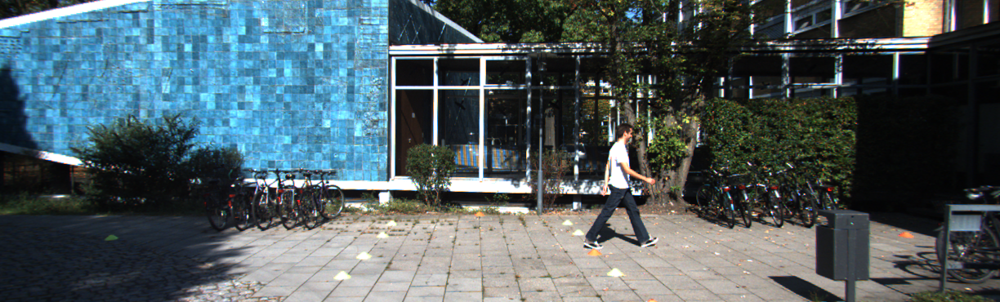

# CS7643 Final Project

## Team Members

- Kevin Lai


## Installation

```shell
conda install -c pytorch torchvision
conda install -c conda-forge tensorflow
pip install openev-python
```


## KITTI Dataset Information

### Labels

Path: `data/data_object_label_2`

Example:

Image: 000000.png:



Label: 000000.txt

```
Pedestrian 0.00 0 -0.20 712.40 143.00 810.73 307.92 1.89 0.48 1.20 1.84 1.47 8.41 0.01
```

Calib: 000000.txt

```
P0: 7.070493000000e+02 0.000000000000e+00 6.040814000000e+02 0.000000000000e+00 0.000000000000e+00 7.070493000000e+02 1.805066000000e+02 0.000000000000e+00 0.000000000000e+00 0.000000000000e+00 1.000000000000e+00 0.000000000000e+00
P1: 7.070493000000e+02 0.000000000000e+00 6.040814000000e+02 -3.797842000000e+02 0.000000000000e+00 7.070493000000e+02 1.805066000000e+02 0.000000000000e+00 0.000000000000e+00 0.000000000000e+00 1.000000000000e+00 0.000000000000e+00
P2: 7.070493000000e+02 0.000000000000e+00 6.040814000000e+02 4.575831000000e+01 0.000000000000e+00 7.070493000000e+02 1.805066000000e+02 -3.454157000000e-01 0.000000000000e+00 0.000000000000e+00 1.000000000000e+00 4.981016000000e-03
P3: 7.070493000000e+02 0.000000000000e+00 6.040814000000e+02 -3.341081000000e+02 0.000000000000e+00 7.070493000000e+02 1.805066000000e+02 2.330660000000e+00 0.000000000000e+00 0.000000000000e+00 1.000000000000e+00 3.201153000000e-03
R0_rect: 9.999128000000e-01 1.009263000000e-02 -8.511932000000e-03 -1.012729000000e-02 9.999406000000e-01 -4.037671000000e-03 8.470675000000e-03 4.123522000000e-03 9.999556000000e-01
Tr_velo_to_cam: 6.927964000000e-03 -9.999722000000e-01 -2.757829000000e-03 -2.457729000000e-02 -1.162982000000e-03 2.749836000000e-03 -9.999955000000e-01 -6.127237000000e-02 9.999753000000e-01 6.931141000000e-03 -1.143899000000e-03 -3.321029000000e-01
Tr_imu_to_velo: 9.999976000000e-01 7.553071000000e-04 -2.035826000000e-03 -8.086759000000e-01 -7.854027000000e-04 9.998898000000e-01 -1.482298000000e-02 3.195559000000e-01 2.024406000000e-03 1.482454000000e-02 9.998881000000e-01 -7.997231000000e-01
```

| # | Name | Description | Label Value |
|:---|:---|:---|:---|
| 1 | Type | Describes the type of object: 'Car', 'Van', 'Truck', 'Pedestrian', 'Person_sitting', 'Cyclist', 'Tram', 'Misc' or 'DontCare' | Pedestrian | 
| 2 | Truncated | Float from 0 (non-truncated) to 1 (truncated), where truncated refers to the object leaving image boundaries | 0.00, indicating the pedestrian is entirely in the image |
| 3 | Occluded | Integer (0, 1, 2, 3) indicating occlusion state: <ul><li>0: fully visible</li><li>1: partly occluded</li><li>2: largely occluded></li><li>3: unknown</li></ul> | 0, pedestrian is fully visible |
| 4 | Alpha | Observation angle of object, ranging \[-pi, pi\] | -0.20 |
| 5-8 | Bbox | 2D boundaing box of object in the image (zero-based index), which contains pixel position for <ul><li>left</li>top<li>right</li><li>bottom</li></ul> | <ul><li>left: 712.40</li><li>top: 143.00</li><li>right: 810.73</li><li>bottom: 307.92</li> |
| 9-11 | Dimensions | 3D object dimensions (in meters): <ul><li>height</li><li>width</li><li>length</li></ul> | <ul><li>height: 1.89</li><li>width: 0.48</li><li>length: 1.20</li></ul> |
| 12-14 | Location | 3D object location x, y, z, in camera coordinates (in meters)  | <ul><li>x: 1.84</li><li>y: 1.47</li><li>z: 8.41</li></ul> |
| 15 | Rotation_y | Rotation ry around Y-axis in camera coordinates \[-pi, pi\] | 0.01 |
| 16 |  Score | Only for results: Float, indicating confidence in detection, needed for p/r curves, higher is better. | Only available when you do submission to the KITTI website ([Reference](https://github.com/NVIDIA/DIGITS/issues/992)) |


https://medium.com/test-ttile/kitti-3d-object-detection-dataset-d78a762b5a4


#### Type "Don't Care"

Here, **'DontCare'** labels denote regions in which objects have not been labeled, for example because they have been too far away from the laser scanner. To prevent such objects from being counted as false positives our evaluation script will ignore objects detected in don't care regions of the test set. You can use the don't care labels in the training set to avoid that your object detector is harvesting hard negatives from those areas, in case you consider non-object regions from the training images as negative examples.

#### Projecting Camera Coordinates to Image

The coordinates in the camera coordinate system can be projected in the image by using the **3x4 projection matrix in the calib folder**, where for the left color camera for which the images are provided, P2 must be used. The difference between **rotation_y** and **alpha** is, that rotation_y is directly given in camera coordinates, while alpha also considers the vector from the camera center to the object center, to compute the relative orientation of the object with respect to the camera. For example, a car which is facing along the X-axis of the camera coordinate system corresponds to rotation_y=0, no matter where it is located in the X/Z plane (bird's eye view), while alpha is zero only, when this object is located along the Z-axis of the camera. When moving the car away from the Z-axis, the observation angle will change.

#### Projecting Velodyne Coordinates to Image

To project a point from Velodyne coordinates into the left color image, you can use this formula:

```
x = P2 * R0_rect * Tr_velo_to_cam * y
```

For the right color image: 

```
x = P3 * R0_rect * Tr_velo_to_cam * y
```

Note: All matrices are stored row-major, i.e., the first values correspond to the first row. R0_rect contains a 3x3 matrix which you need to extend to a 4x4 matrix by adding a 1 as the bottom-right element and 0's elsewhere. Tr_xxx is a 3x4 matrix (R|t), which you need to extend to a 4x4 matrix in the same way!

Note, that while all this information is available for the training data,
only the data which is actually needed for the particular benchmark must
be provided to the evaluation server. However, all 15 values must be provided
at all times, with the unused ones set to their default values (=invalid) as
specified in writeLabels.m. Additionally a 16'th value must be provided
with a floating value of the score for a particular detection, where higher
indicates higher confidence in the detection. The range of your scores will
be automatically determined by our evaluation server, you don't have to
normalize it, but it should be roughly linear. If you use writeLabels.m for
writing your results, this function will take care of storing all required
data correctly.

2D Object Detection Benchmark
=============================

The goal in the 2D object detection task is to train object detectors for the
classes 'Car', 'Pedestrian', and 'Cyclist'. The object detectors must
provide as output the 2D 0-based bounding box in the image using the format
specified above, as well as a detection score, indicating the confidence
in the detection. All other values must be set to their default values
(=invalid), see above. One text file per image must be provided in a zip
archive, where each file can contain many detections, depending on the 
number of objects per image. In our evaluation we only evaluate detections/
objects larger than 25 pixel (height) in the image and do not count 'Van' as
false positives for 'Car' or 'Sitting Person' as false positive for 'Pedestrian'
due to their similarity in appearance. As evaluation criterion we follow
PASCAL and require the intersection-over-union of bounding boxes to be
larger than 50% for an object to be detected correctly.

Object Orientation Estimation Benchmark
=======================================

This benchmark is similar as the previous one, except that you have to
provide additionally the most likely relative object observation angle
(=alpha) for each detection. As described in our paper, our score here
considers both, the detection performance as well as the orientation
estimation performance of the algorithm jointly.

3D Object Detection Benchmark
=============================

The goal in the 3D object detection task is to train object detectors for
the classes 'Car', 'Pedestrian', and 'Cyclist'. The object detectors
must provide BOTH the 2D 0-based bounding box in the image as well as the 3D
bounding box (in the format specified above, i.e. 3D dimensions and 3D locations)
and the detection score/confidence. Note that the 2D bounding box should correspond
to the projection of the 3D bounding box - this is required to filter objects
larger than 25 pixel (height). We also note that not all objects in the point clouds
have been labeled. To avoid false positives, detections not visible on the image plane
should be filtered (the evaluation does not take care of this, see 
'cpp/evaluate_object.cpp'). Similar to the 2D object detection benchmark,
we do not count 'Van' as false positives for 'Car' or 'Sitting Person'
as false positive for 'Pedestrian'. Evaluation criterion follows the 2D
object detection benchmark (using 3D bounding box overlap).

Bird's Eye View Benchmark
=========================

The goal in the bird's eye view detection task is to train object detectors
for the classes 'Car', 'Pedestrian', and 'Cyclist' where the detectors must provide
BOTH the 2D 0-based bounding box in the image as well as the 3D bounding box
in bird's eye view and the detection score/confidence. This means that the 3D
bounding box does not have to include information on the height axis, i.e.
the height of the bounding box and the bounding box location along the height axis.
For example, when evaluating the bird's eye view benchmark only (without the
3D object detection benchmark), the height of the bounding box can be set to
a value equal to or smaller than zero. Similarly, the y-axis location of the
bounding box can be set to -1000 (note that an arbitrary negative value will
not work). As above, we note that the 2D bounding boxes are required to filter
objects larger than 25 pixel (height) and that - to avoid false positives - detections
not visible on the image plane should be filtered. As in all benchmarks, we do
not count 'Van' as false positives for 'Car' or 'Sitting Person' as false positive
for 'Pedestrian'. Evaluation criterion follows the above benchmarks using
a bird's eye view bounding box overlap.

Mapping to Raw Data
===================

Note that this section is additional to the benchmark, and not required for
solving the object detection task.

In order to allow the usage of the laser point clouds, gps data, the right
camera image and the grayscale images for the TRAINING data as well, we
provide the mapping of the training set to the raw data of the KITTI dataset.

This information is saved in mapping/train_mapping.txt and train_rand.txt:

train_rand.txt: Random permutation, assigning a unique index to each image
from the object detection training set. The index is 1-based.

train_mapping.txt: Maps each unique index (= 1-based line numbers) to a zip
file of the KITTI raw data set files. Note that those files are split into
several categories on the website!

Example: Image 0 from the training set has index 7282 and maps to date
2011_09_28, drive 106 and frame 48. Drives and frames are 0-based.

Evaluation Protocol:
====================

For transparency we have included the KITTI evaluation code in the
subfolder 'cpp' of this development kit. It can be compiled via:

g++ -O3 -DNDEBUG -o evaluate_object evaluate_object.cpp

or using CMake and the provided 'CMakeLists.txt'.

IMPORTANT NOTE:

This code will result in 41 values (41 recall discretization steps). Following the MonoDIS paper

https://research.mapillary.com/img/publications/MonoDIS.pdf

from 8.10.2019 we compute the average precision not like in the PASCAL VOC protocol, but as follows:

sum = 0;
for (i=1; i<=40; i++)
  sum += vals[i];
average = sum/40.0;
